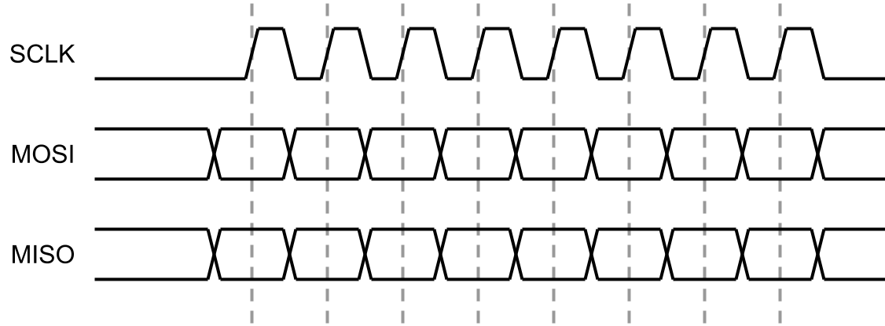
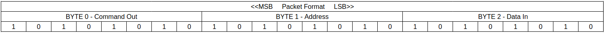
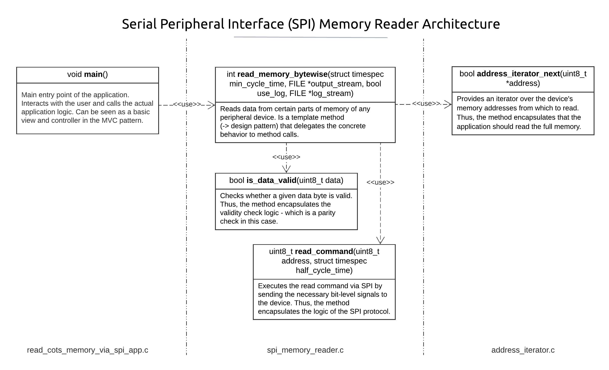
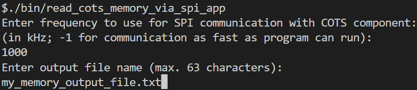
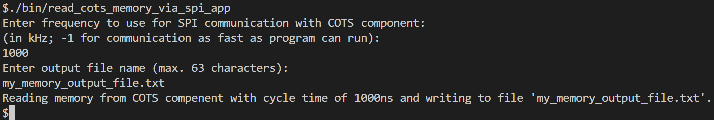

# Serial Peripheral Interface (SPI) Memory Reader

## Description

**Summary**: An application written in C for serial communication with a peripheral device on a bit-level. Its goal is to read data from a peripheral memory device, correct transmission errors, and write the data to an output.

Given a peripheral memory device, this application communicates with it via the Serial Peripheral Interface (SPI) protocol. Therefore, the device has to implement the given API (see [API definition](#given-api-definition)). Then, the application uses this API to communicate with the device by sending binary signals to the device and receiving binary signals from the device.

In this project, I demonstrate skills in
* programming in C, 
* working with hardware devices on a low level, 
* maintaining a balance between a reusable design and efficient code.

## Table of Contents 

- [Problem](#problem)
- [Solution](#solution)
- [Installation](#installation)
- [Usage](#usage)
- [Credits](#credits)
- [License](#license)

## Problem
### Problem Definition

Assume a peripheral device, for instance, a Commercial Off-the-Shelf (COTS) component, is given. Further, the device has an addressable memory. The goal is to obtain the content of this memory. The device provides an API to communicate with it by sending raw bits in a specified packet format. Thus, the problem is to build an application that uses this API to 

   - read data from every address of the device's memory,
   - detect and correct errors in the data by re-requesting the data,
   - print the contents of the memory to a human-readable plain-text file.

A short and potentially faulty documentation of the API exists and follows. Other details had to be derived from testing. An implementation of the API is given for a software mock device (i.e., no real physical hardware is used). 

### Given API Definition
The following is the definition of the API. It comes with:
- `src/component.h`: An interface definition of the provided methods in C
- `lib/component.o`: An implementation of the API for an imaginary device in pure software. It can be used to examine the specifics of the API and test the functionality of the developed app

The device communicates through the API via the Serial Peripheral Interface (SPI) protocol in [mode 1 (CPOL=0, CPHA=1)](https://en.wikipedia.org/wiki/Serial_Peripheral_Interface). For raw bit communication, three logic signals are used. The first is a clock line that switches back and forth between high and low.
In addition to this clock line, are two data lines for communication. One from the application into the device (Master Out Slave In, or MOSI) and one from the device into the application (Master In Slave Out, MISO). On each rising edge of the clock line, the device will sample the level of the MOSI line, and if any data is to be sent back, the MISO line will also switch its level on the rising clock edge. A timing diagram for this communication is provided below, with the dotted line indicating when a bit is sampled or set: 



To implement this communication protocol in code, the device API provided in this repository has 3 functions to use:

- `void SET_CLK(boolean level)`: Sets the clock line to the specified boolean logic level,

- `void SET_MOSI(boolean level)`: Sets the MOSI line to the specified boolean logic level,

- `boolean READ_MISO()`: Returns the boolean logic level of the MISO line.

The device is treated as a black box. The only fact that is assumed about the device is that it has an addressable memory which is comprised of 256 8-bit words. Every communication between the devices has to be initiated by the host (the application). To read data from the device, the application must send 2 bytes to the device to receive a single byte of data from a particular memory address of the device. 16 clock pulses MUST be completed for the device to begin relaying data, and an additional 8 clock pulses, for a total of 24, MUST be completed to complete the communication with the device. Shown below is a packet format diagram: 



The command for reading data is `0x55`. The data byte will consist of 7 data bits, with the least significant bit acting as an even parity bit. For this project, we assume that any error in the data resulted in an odd number of bits flipping. The 7 bits of data will be encoded in 7-bit ASCII.

## Solution
The application is structured in the following design. Each box in the diagram stands for a method in C. The vertical lines indicate how the methods are separated into different files.




## Installation
System Requirements:
- GCC compiler installed
- Make installed

The project's compilation and installation are managed with Make. To run the application on your machine, follow these steps: 
1. Clone the repository
2. 
    Open a terminal, switch your working directory to the repositories root, and execute the command `make`:    
    ```
    $ make
    ```
    This will make use of the provided `Makefile` in the repositories root folder to compile and link the project's source files into an executable on your system. The executable is generated in the path `bin/read_cots_memory_via_spi_app`.


## Usage

For demonstration reasons, the project comes with an example implementation of the peripheral device API. It is provided through a pre-compiled c object file which can be found in `lib/component.o`. 

To use this project with your own peripheral device, you need to provide an implementation of the API interface in `src/component.h`. This interface is further explained in the [API definition](#given-api-definition).

To use the application with the provided API implementation, follow the steps in [Installation](#installation) and execute the generated executable `bin/read_cots_memory_via_spi_app` on the command line.

The application will start and prompt for a frequency to interact with the peripheral device and name of an output file. 
- The provided frequency is the frequency the application will use for serial communication with the peripheral device. More precisely, it defines the clock frequency to use for the Serial Peripheral Interface (SPI) protocol.

- The provided file specifies a path to where the application should write the read memory content. 




After the user entered the required inputs, the application will confirm the inputs, read the memory from the peripheral device, and return as soon as it is done reading. It also creates a log file in the same folder as the executable which
shows the errors and corrections during data transfer.



## Credits

This project was made as a demonstration of skills in C programming, embedded systems, and low-level hardware interaction in cooperation with the University of Georgia's Small Satellite Research Laboratory ([SSRL]((https://www.smallsat.uga.edu/))). The API for the peripheral component was created by them.

## License

Licensed under the [GNU General Public License](LICENSE).
